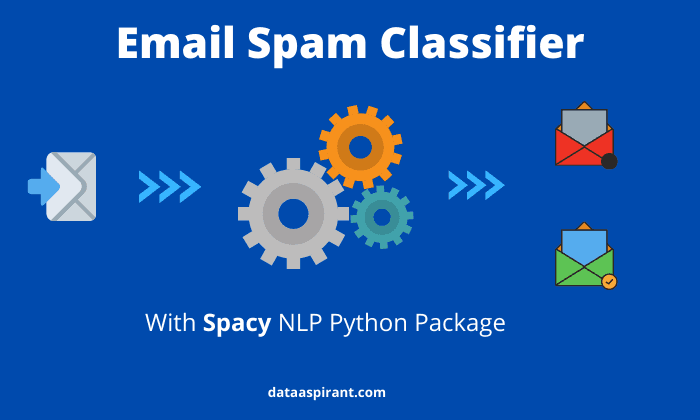

# Data Science Portfolio - NDONGO Mamoudou 

Ce portfolio regroupe l'ensemble des projets que j'ai réalisés en science des données et en analyse de données dans le cadre de mes études, de mon apprentissage personnel et par passion. Il met également en avant mes réalisations, mes compétences et mes certifications, avec des mises à jour régulières pour refléter ma progression.

#### Email :  mamoudoundongo78@gmail.com

#### Linkedin : https://www.linkedin.com/in/mamoudou-ndongo/

## Réalisations

## Projets

   [Classification : Emails (Spam) et Cancer](https://github.com/NdongoMamoudou/Deep_Learning_pour_la_Classification_Binaire)

                                                               Ce dépôt regroupe deux projets exploitant des modèles de Deep Learning pour résoudre 
                                                               
                                                               des problématiques de classification binaire. Le premier projet porte sur la classification d'emails, 
                                                               
                                                               avec pour objectif d'identifier si un message est un spam ou non. Le second projet se concentre sur la 
                                                               
                                                               classification médicale, visant à prédire si une personne est atteinte de cancer.                                                              

## Microprojets

## Compétences de base

  • Methodologies: Machine Learning, Deep Learning, Statistics, Big Data Analytics
  
  • Languages: Python (Pandas, Numpy, Scikit-Learn, Scipy, Keras, Matplotlib), SQL, C++
  
  • Tools: MySQL, Tableau, Git, PySpark, Amazon Web Services (AWS), Flask, MS Excel
  

## Certificats

  • [Certificat Python - La visualisation des données](./Certificats/CertificatDaccomplissement_Python_La_visualisation_des_donnees.pdf)
  
  • [Certificat Python - La visualisation des données](./Certificats/CertificatDaccomplissement_Python_La_visualisation_des_donnees.pdf)
  
  • [Certificat Python - Niveau avancé](./Certificats/CertificatDaccomplissement_Python_Niveau_avance.pdf)
  
  • [Certificat Pandas pour la data science](./Certificats/CertificatDaccomplissement_pandas%20_pour%20_la_%20data_science.pdf)

  • [Scrum Fundamentals Certified](./Certificats/ScrumFundamentalsCertified-MamoudouNdongo-1050242.pdf)
  

