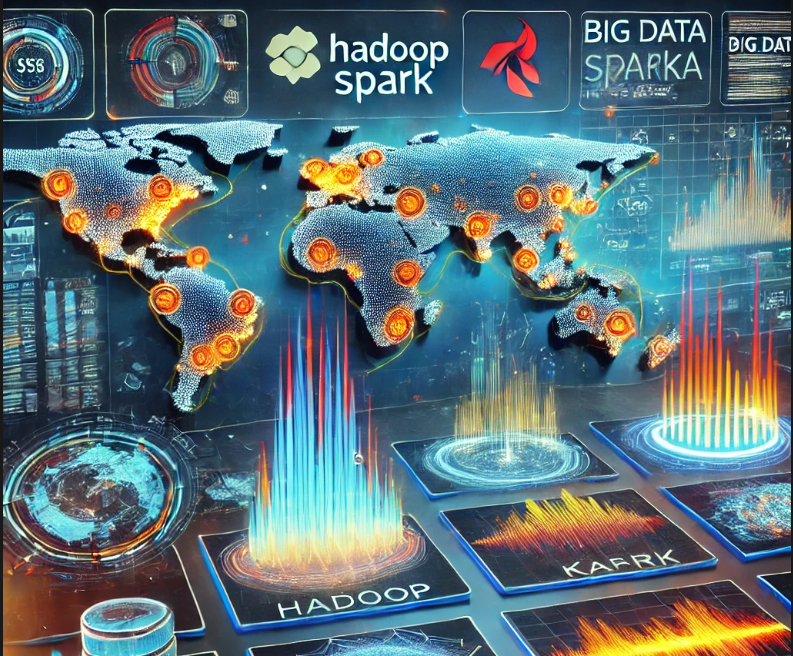

# Dev,BigData et IA Portfolio - NDONGO Mamoudou 

Ce portfolio regroupe l'ensemble des projets que j'ai réalisés en science des données et en analyse de données dans le cadre de mes études, de mon apprentissage personnel et par passion. Il met également en avant mes réalisations, mes compétences et mes certifications, avec des mises à jour régulières pour refléter ma progression.

#### Email :  mamoudoundongo78@gmail.com

#### Linkedin : https://www.linkedin.com/in/mamoudou-ndongo/

## Réalisations

## Projets

<table style="width: 100%; table-layout: fixed;">
  <tr>
    <td style="width: 50%; text-align: center;">
      
    </td>
    <td style="width: 50%;">
      <strong>
        <a href="https://github.com/NdongoMamoudou/planet-discovery-pipeline">
          Système de Découverte et d'Analyse de Planètes avec Flask, Kafka, Spark, HDFS, Hive, Machine Learning et Docker
        </a>
      </strong>
      

        **Ce projet Big Data et Intelligence Artificielle** consiste à construire un pipeline complet pour la gestion, l’analyse et la prédiction des caractéristiques des planètes découvertes dans l’espace. Il combine des technologies de streaming, de stockage distribué, de traitement de données massives et de machine learning pour créer un système robuste d’analyse et de prédiction.
      

      
<strong>Fonctionnalités principales :</strong>

      <ul>
        <li>Développement d’une **API Flask** permettant de recevoir et valider les données de découvertes de planètes via des requêtes HTTP POST</li>
        <li>Conteneurisation de tous les services (Flask, Kafka, Spark, HDFS, Hive) avec **Docker** et **Docker Compose** pour une orchestration simplifiée</li>
        <li>Intégration avec **Kafka** pour la publication des données reçues dans un **topic** dédié au streaming en temps réel</li>
        <li>Configuration d’un pipeline de traitement en temps réel avec **Apache Spark** pour consommer les messages depuis Kafka, effectuer des analyses statistiques et des transformations</li>
        <li>Calcul de métriques agrégées comme la répartition des types de planètes, la moyenne des masses et la corrélation entre la présence d’eau et d’autres caractéristiques</li>
        <li>Développement d’un modèle de **Machine Learning** pour prédire la probabilité d’habitabilité des planètes en fonction de leurs caractéristiques physiques et atmosphériques</li>
        <li>Stockage structuré des données et des résultats d’analyses dans **HDFS** pour la persistance et dans **Hive** pour la requêtabilité via SQL</li>
        <li>Ajout d’une fonctionnalité dans l’**API Flask** permettant de récupérer les données analytiques stockées dans HDFS et Hive et de les exposer sous forme de JSON</li>
        <li>Implémentation d’une route supplémentaire pour uploader directement des fichiers vers **HDFS** depuis l’API Flask</li>
      </ul>
      
<strong>Technologies utilisées :</strong> Flask, Kafka, Apache Spark, HDFS, Hive, Machine Learning, Hadoop, Docker, Docker Compose, Python.

    </td>
  </tr>
</table>

<table style="width: 100%; table-layout: fixed;">
  <tr>
    <td style="width: 50%; text-align: center;">
      
    </td>
    <td style="width: 50%;">
      <strong>
        <a href="https://github.com/NdongoMamoudou/AsteroidCollisionPrediction">
          Prédiction des Collisions d'Astéroïdes avec Hadoop, Kafka, Spark et Machine Learning
        </a>
      </strong>
      

        **Ce projet Big Data et Machine Learning** a pour objectif de traiter et analyser des données d'astéroïdes en temps réel en utilisant un environnement distribué basé sur **Kafka**, **Hadoop (HDFS)** et **Spark**. L’objectif principal est de prédire les trajectoires des astéroïdes et d'évaluer leur probabilité de collision avec la Terre.
      

      
<strong>Fonctionnalités principales :</strong>

      <ul>
        <li>Déploiement d’un environnement distribué avec **Kafka** pour le streaming de données en temps réel, **Hadoop (HDFS)** pour le stockage distribué et **Spark** pour le traitement des données massives</li>
        <li>Génération de données simulées sur les astéroïdes et publication continue sur un topic **Kafka**</li>
        <li>Consommation des données provenant de **Kafka** et stockage dans **HDFS** pour un traitement ultérieur</li>
        <li>Nettoyage et transformation des données avec **Spark** pour les préparer aux analyses</li>
        <li>Analyse des trajectoires des astéroïdes et modélisation prédictive avec **Machine Learning** et **Deep Learning**</li>
        <li>Utilisation de **Spark Streaming** pour les analyses temporelles et le calcul des trajectoires en temps réel</li>
        <li>Création de visualisations des trajectoires des astéroïdes et des probabilités de collision avec **Apache Superset** ou **Echarts**</li>
      </ul>
      
<strong>Technologies utilisées :</strong> Kafka, Hadoop (HDFS), Spark, Machine Learning, Deep Learning, Apache Superset, Echarts.

    </td>
  </tr>
</table>

<table style="width: 100%; table-layout: fixed;">
  <tr>
    <td style="width: 50%; text-align: center;">
      
    </td>
    <td style="width: 50%;">
      <strong>
        <a href="https://github.com/NdongoMamoudou/seismic-data-analysis">
          Analyse et Traitement des Données Sismiques avec Hadoop, Hive et Spark
        </a>
      </strong>
      

        **Ce projet Big Data** a pour objectif de traiter et analyser de grands volumes de données sismiques 
        en utilisant un environnement distribué basé sur **Hadoop, Hive et Spark**. L’objectif principal est 
        de détecter des événements sismiques et de comprendre les tendances sismiques sur différentes périodes.
      

      
<strong>Fonctionnalités principales :</strong>

      <ul>
        <li>Déploiement d’un environnement **Docker** avec **Hadoop, Hive et Spark**</li>
        <li>Importation et traitement des données sismiques stockées sur **HDFS**</li>
        <li>Nettoyage et transformation des données avec **Spark**</li>
        <li>Analyse des événements sismiques et détection de tendances</li>
        <li>Intégration de **Kafka** et **Spark Streaming** pour les analyses temporelles</li>
        <li>Possibilité d’ajouter une interface de visualisation avec **Apache Superset** ou **Echarts**</li>
      </ul>
      
<strong>Technologies utilisées :</strong> Docker, Hadoop (HDFS), Hive, Spark, Kafka, Apache Superset, Echarts.

    </td>
  </tr>
</table>

<table style="width: 100%; table-layout: fixed;">
  <tr>
    <td style="width: 50%; text-align: center;">
      
    </td>
    <td style="width: 50%;">
      <strong>
        <a href="https://github.com/NdongoMamoudou/WebScrapingCollection">
          Web Scraping Collection
        </a>
      </strong>
      

        Un projet d'extraction automatisée de données à partir de sites web. Il permet de collecter des informations structurées (produits, prix, articles, etc.) 
        de manière rapide et efficace pour des analyses ou surveiller des données en temps réel.
      

      
<strong>Technologies utilisées :</strong> Python, BeautifulSoup, scrapy, Selenium, Requests, Pandas.

    </td>
  </tr>
</table>

<table style="width: 100%; table-layout: fixed;">
  <tr>
    <td style="width: 50%; text-align: center;">
      
    </td>
    <td style="width: 50%;">
      <strong>
        <a href="https://github.com/NdongoMamoudou/gp_colis">
          GP Colis - Gestion des Colis entre le Sénégal et la France
        </a>
      </strong>
      

        **GP Colis** est une application web dédiée à la gestion et à la publication d'annonces pour l'envoi ou la réception de colis entre le Sénégal et la France. 
        Les utilisateurs peuvent publier des annonces, consulter celles des autres, et organiser des envois de colis en utilisant une interface conviviale et responsive.
      

      
<strong>Fonctionnalités principales :</strong> Création de comptes, publication d'annonces de colis, validation des informations, affichage dynamique des villes via API.

      
<strong>Technologies utilisées :</strong> React.js, Node.js, Axios, API REST, Nginx (Reverse Proxy), HTML5, CSS3.

    </td>
  </tr>
</table>

<table style="width: 100%; table-layout: fixed;">
  <tr>
    <td style="width: 50%; text-align: center;">
      
    </td>
    <td style="width: 50%;">
      <strong>
        <a href="https://github.com/NdongoMamoudou/Deep_Learning_pour_la_Classification_Binaire">
          Classification : Emails (Spam) et Cancer
        </a>
      </strong>
      

        Ce dépôt regroupe deux projets exploitant des modèles de Deep Learning pour résoudre des problématiques de classification binaire. 
        Le premier projet porte sur la classification d'emails, avec pour objectif d'identifier si un message est un spam ou non. 
        Le second projet se concentre sur la classification médicale, visant à prédire si une personne est atteinte de cancer.
      

    </td>
  </tr>
</table>

<table style="width: 100%; table-layout: fixed;">
  <tr>
    <td style="width: 50%; text-align: center;">
      
    </td>
    <td style="width: 50%;">
      <strong>
        <a href="https://github.com/NdongoMamoudou/analyse-donnees_fraude-marketing">
          Analyse des Comportements d'Achat des Clients - Campagne Marketing
        </a>
      </strong>
      

        Ce projet explore les comportements d'achat des clients d'une entreprise à partir des données de campagnes marketing. L'objectif est de 
        réaliser une analyse exploratoire des données (EDA) pour mieux comprendre les habitudes d'achat des clients, nettoyer et préparer les 
        données, puis appliquer une segmentation basée sur les revenus et les dépenses. Cette analyse est présentée sous forme d'un tableau de bord 
        interactif développé avec Streamlit, permettant d'interagir facilement avec les insights obtenus. 
      

    </td>
  </tr>
</table>

                                                  
## Compétences 

📊 Data Science & Machine Learning
  - Méthodologies : Machine Learning, Deep Learning, Statistiques, Big Data Analytics, Web Scraping
  - Modélisation : Régression, Classification, Clustering, Séries temporelles
  - Traitement de Données : Feature Engineering, Data Cleaning, Data Wrangling

💻 Langages de Programmation
   - Python : Pandas, NumPy, Scikit-Learn, SciPy, Keras, TensorFlow, Matplotlib, Seaborn
   - SQL : MySQL, PostgreSQL, SQLite
   - Autres : JavaScript, C++,

📂 Big Data & Cloud Computing
  - Big Data : Hadoop (HDFS, Hive), Spark (PySpark, Spark SQL), Kafka
  - Cloud Computing : AWS (S3, Lambda, EC2),

🌐 Développement Web & API
 - Front-End : HTML5, CSS3, JavaScript (React.js)
 - Back-End : Python (Flask, FastAPI, Django)
 - Bases de Données : MySQL, PostgreSQL, MongoDB, 
 - Déploiement : Docker, Nginx

📈 Visualisation de Données
 - Libraries Python : Matplotlib, Seaborn, Plotly
 - BI & Dashboards : Power BI, Tableau , Streamlit

🛡️ Soft Skills
 - Résolution de problèmes
 - Communication des résultats
 - Gestion de projet Agile / Scrum
 - Travail en équipe
  

## Certificats

  • [Certificat Python - La visualisation des données](./Certificats/CertificatDaccomplissement_Python_La_visualisation_des_donnees.pdf)
  
  • [Certificat Python - La visualisation des données](./Certificats/CertificatDaccomplissement_Python_La_visualisation_des_donnees.pdf)
  
  • [Certificat Python - Niveau avancé](./Certificats/CertificatDaccomplissement_Python_Niveau_avance.pdf)
  
  • [Certificat Pandas pour la data science](./Certificats/CertificatDaccomplissement_pandas%20_pour%20_la_%20data_science.pdf)

  • [Scrum Fundamentals Certified](./Certificats/ScrumFundamentalsCertified-MamoudouNdongo-1050242.pdf)
  

